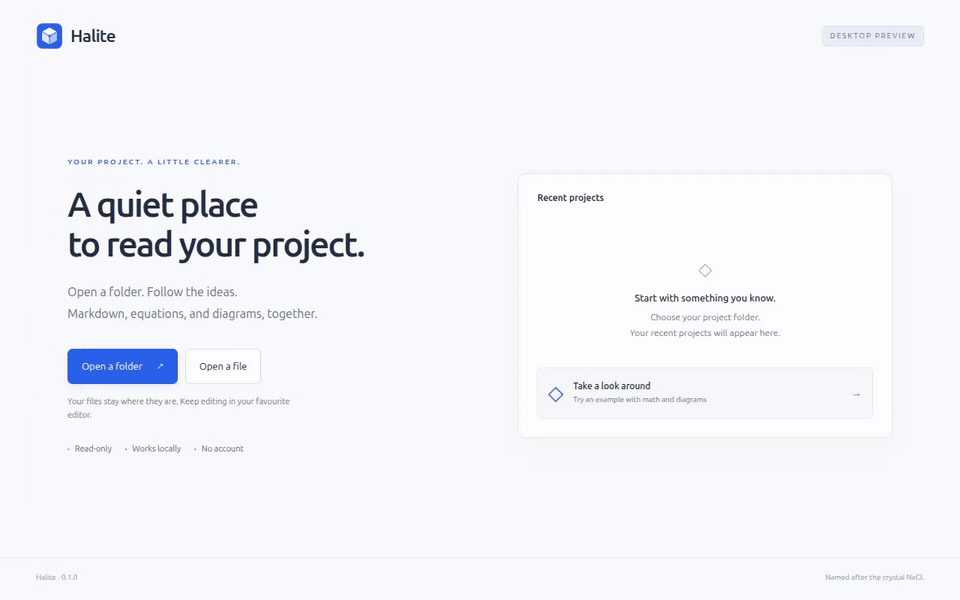
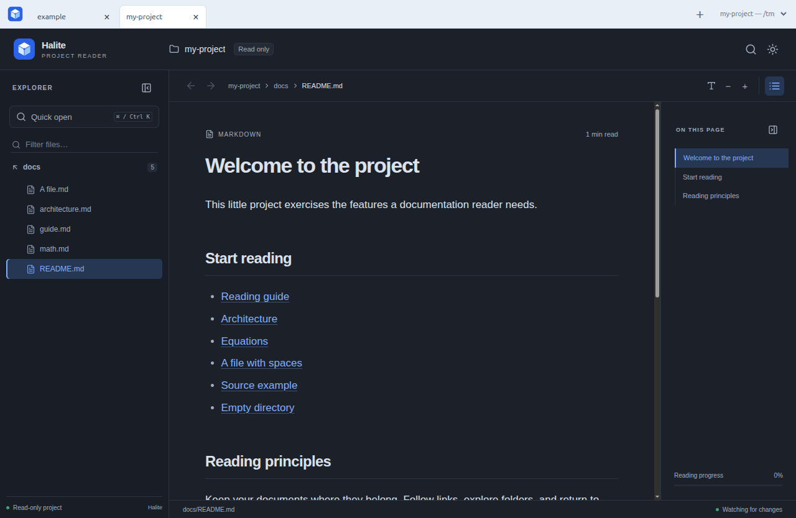

# Halite

**A quiet place to read your project.**

[Product website, demo, and pricing](https://halite-reader.pages.dev/)

Halite is a local, read-only Markdown reader for developers and researchers.
Open an existing project, follow its links, and read its equations and diagrams.
Keep writing in Neovim or your favourite editor; Halite refreshes as you save.
Your documents stay in their original directories.

Named after halite, the crystalline form of sodium chloride (NaCl).
By [M. Kim](https://github.com/m-kim-dev).

The marketing page is hosted on Cloudflare Pages. See its [build and deployment guide](docs/marketing.md).

Source is available under the [MIT license](LICENSE). The planned paid desktop
downloads support packaging and maintenance; building from source stays an option.

[](docs/images/halite-demo.mp4)

[Watch the 20-second demo (MP4)](docs/images/halite-demo.mp4) ·
[Still screenshot](docs/images/halite-reader.png)

## Linux desktop preview

The desktop preview adds project tabs, optional separate windows, a native
folder/file picker, recent projects, and a built-in example. All projects share
one local backend and one port, including projects opened from the CLI. Its packages include the runtime, so readers do not need Node.
See the [published preview installation guide](https://github.com/m-kim-dev/halite/blob/v0.2.0-preview.1/docs/linux-preview.md) for installation,
preview limitations, and feedback prompts.

[Download the Linux x64 preview](https://github.com/m-kim-dev/halite/releases/tag/v0.2.0-preview.1) ·
[Join the preview testers](https://github.com/m-kim-dev/halite/discussions/1) ·
[Report a problem or share feedback](https://github.com/m-kim-dev/halite/issues/new?template=preview-feedback.yml)

The current preview and CLI are free to try. The proposed desktop price is
**$19 once** after installation and usage have been validated. Purchasing is not
available yet. See the [launch plan](docs/monetization.md).

To build locally on Linux (requires Node, npm, `tar`, and `dpkg-deb`):

```bash
npm ci
npm run package:linux
```

This produces `.deb` and `.tar.gz` files with SHA-256 checksums under `release/`.
The `.deb` passed installation, sandboxed workflows, a synthetic revision upgrade,
and removal in Debian 12 and Ubuntu 24.04 x64 containers. Real desktop sessions
still need tester feedback; see the [validation record](docs/validation.md).

## Run the CLI

Requires Node.js **22.12 or newer** and npm. From this repository:

```bash
npm ci
npm run build
npm start -- /path/to/project
```

The command starts or reuses one background service, opens a project tab, and
exits. The service chooses one available loopback port and prints the workspace
URL. Later commands reuse that same process and port. Use `--no-open` to print
the URL without launching a browser. An already-connected workspace receives
new project tabs without opening another browser tab.

```bash
npm start -- /path/to/another-project
npm start -- /path/to/third-project --window
npm start -- status
npm start -- stop
```

`--tab` and `--window` override the saved opening preference. Browser window
placement and foreground activation depend on the browser; Halite manages its
desktop windows directly. The shared CLI service supports Linux and macOS;
Windows shared-service support is not implemented.

Other entry points:

```bash
# Read the current directory (this viewer's own docs, when run here).
npm start

# Start with a particular document.
npm start -- /path/to/project/docs/README.md

# Open a directory without discovering a containing repository.
npm start -- /path/to/docs --root /path/to/docs

# Choose the service port on its first start (stop it before changing ports).
npm start -- /path/to/project --port 4174 --no-open
```

To make the `halite` command available in your npm environment, run `npm link`
once from this directory after building. Then use it from any project:

```bash
halite .
halite docs/README.md
halite --help
```

`npm link` uses your configured npm global prefix. The application itself does not
require administrator privileges.
If you previously linked the `mdview` command, rerun `npm link` to register `halite`.

## Working with several projects



Projects open in tabs by default. Click **+** or use **Ctrl+T** in the desktop
app to reach recent projects and the open controls. Choose **Open projects in →
Windows** on that screen to save a different default, or use the File menu's
explicit **Open Folder in New Tab/Window** commands. **Ctrl+N** creates a window;
**Ctrl+Tab / Ctrl+Shift+Tab** switch projects and **Ctrl+W** closes a project tab.
Browser shortcuts may be reserved by the browser; the on-screen controls always
work. Closing the last project tab shows Welcome.

Right-click a project tab to move it to a new or existing window. Switching tabs
keeps each reader mounted, including its reading position and navigation history.
Moving between windows reloads the view and restores its saved document and
position while retaining the project's index and watcher. Reopening an already
open project activates its existing tab. The full path is available in a tooltip
and in the project selector; recent projects can be searched by name or path.

Desktop and CLI use the same service when their `HALITE_STATE_DIR` matches.
Closing the desktop leaves that service available for the next command. Unused
project sessions are released after 30 seconds; disconnected browser workspaces
also have a 30-second reconnect grace period. Use `halite stop` to stop the whole
service. Recent projects and preferences persist; open tabs are not restored
after a service restart. Reopen Halite to obtain fresh workspace URLs.

The Linux packages include a `halite` CLI launcher using their bundled runtime,
as well as `halite-desktop`. See the [architecture and design](docs/multiple-projects.md).

## Reading features

- A Markdown file explorer, folder filtering, and fuzzy quick open across
  filenames, paths, and document titles.
- A heading outline, breadcrumbs, and back/forward navigation with restored
  reading positions.
- GitHub-style tables and task lists; highlighted code with copy controls.
- Mermaid diagrams and local PNG, JPEG, GIF, WebP, AVIF, and SVG images, with
  expanded views and zoom.
- KaTeX math using `$...$`, `$$...$$`, `\(...\)`, and `\[...\]`.
- Relative document and directory links, project-root links, and read-only
  previews of linked source/configuration files.
- Refresh after external file edits, light/dark themes, adjustable text size,
  and collapsible sidebars.

Press **Ctrl+K** or **Cmd+K** to find a document. Use arrow keys and Enter in quick
open. The explorer supports arrow-key movement, left/right expansion, and Enter
to open a file. Normal browser **Ctrl/Cmd+F** searches the current document.
The desktop reader provides **Ctrl+F**, next/previous matches with **F3/Shift+F3**,
and optional case matching. Press **Escape** to close find.

## Self-hosting and file access

The Node service and browser UI run on your machine. The shared service listens only on
`127.0.0.1`. New filesystem paths are registered through the private local
control socket by the CLI or desktop picker; browser actions can reopen recents. There are no accounts, cloud storage, uploads, or external rendering
services. Scripts, styles, and math fonts are served locally. Remote images and
external links contained in a document still need their respective network
destinations.

The accessible root is the nearest enclosing Git repository, or the supplied
directory when no repository is found. `--root` overrides this. The explorer
initially focuses on `docs/` when appropriate, while links can reach other files
inside the root. Leading `/` in document links means the project root. Paths and
symlinks leaving that root are rejected.

The explorer hides dotfiles, dependency/build directories, symlinks, and ignored
files. It reads nested `.gitignore` files. Files hidden from the explorer are not
an access-control boundary: a supported direct link inside the root can still
open them.

To run on your own remote machine while retaining loopback-only access, start
the app there with `--port 4173 --no-open`, then forward the same port from your computer:

```bash
ssh -N -L 4173:127.0.0.1:4173 user@your-server
```

Open the printed workspace URL locally (including its `/workspaces/.../` path). Direct LAN/public binding and built-in
authentication are not implemented.

## Preferences

Viewer state is separate from project files. It stores theme, text size, expanded
folders, last document, and up to 200 reading positions in a JSON file keyed by
the canonical project root.

The default directory is `$XDG_STATE_HOME/halite`, or
`~/.local/state/halite`. Set `HALITE_STATE_DIR` to use another directory:

```bash
HALITE_STATE_DIR=/tmp/halite-state npm start -- /path/to/project
```

When upgrading from Markdown Viewer, Halite reads the project's old preferences
from the `markdown-viewer` state directory if no Halite preferences exist yet.
The next preference save writes them to `halite`, preserving the original file.
The old `MDVIEW_STATE_DIR` override is still supported; `HALITE_STATE_DIR` takes
precedence when both are set. When either variable is set, Halite reads and writes
only that directory.

The API provides no project write or command-execution endpoints. Task-list
checkboxes are disabled. Edit files in Neovim or your preferred editor; the
viewer follows those changes.

## Development and checks

For the desktop shell, first run `npm run build` and `npm run desktop:setup`,
then `npm run desktop`. The setup command downloads Electron's runtime.
`npm run test:desktop` verifies a built Linux archive in a temporary installation;
see [release instructions](docs/releasing.md) for its sandbox requirements.

```bash
# TypeScript server and Vite UI with development refresh.
npm run dev -- /path/to/project --no-open

# Unit/integration checks and the production build.
npm run check

# Browser checks against a temporary copy of the bundled fixtures.
npx playwright install chromium
npm run test:e2e
npm run test:cli
npm run test:workspace
```

Browser checks use port 4187 and require a production build first. They cover
navigation, math, diagrams, images, source previews, reading positions, file
watching, and a narrow layout. They do not modify your real projects.

## Current limits

Markdown and text previews are limited to 2 MB; image assets to 30 MB. The reader
supports `.md` and `.markdown` in its index. Linked MDX files are shown as text;
JSX is never executed. Arbitrary embedded HTML is displayed as source. Invalid
diagrams or math show a local fallback. Math follows the supported KaTeX syntax.

Search currently covers names, paths, and titles. Full-text project search,
document tabs within a project, split panes, editing, and synchronization are
future work. Project tabs and separate project windows are available in 0.2. Large code blocks and tables scroll horizontally. Extremely large
repositories may take longer to index because discovery and watching are local.

## Learn the implementation

- [Design and rationale](docs/design.md): the original requirements and tradeoffs.
- [Implementation walkthrough](docs/architecture.md): follow a command, request,
  document, and file-change notification through the code.
- [Validation record](docs/validation.md): what has been checked and what the
  results establish.
