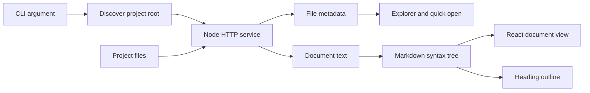
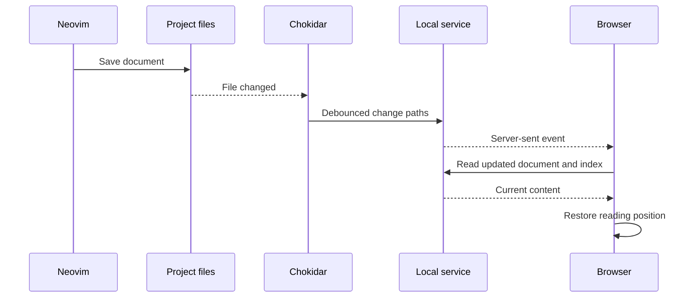

# How Halite works

The application has two running parts: a Node.js process that reads your project
and a React interface in your browser. Both run locally. The project directory
is the document store; the viewer maintains a separate, small preferences file.

This walkthrough explains the first implementation. The [design notes](design.md)
explain why these behaviors were chosen, and the [README](../README.md) contains
the commands needed to run it.

## Desktop entry point

[desktop/main.cjs](../desktop/main.cjs) wraps the same production reader in
Electron. The built-in `halite://app/index.html` welcome screen can request a
native file/folder picker, open the example, and reopen validated recent paths.
Each project gets a loopback server on a free port. Switching projects or
returning to Welcome closes the previous server; quitting closes the final one.

The renderer has sandboxing and context isolation enabled, without Node access.
The small preload bridge is available only on the built-in welcome page; IPC
handlers also verify the sender and main frame. Project documents receive no
bridge. Native navigation is constrained to the current reader; external HTTP,
HTTPS, and mail links open through the operating system. Clipboard writes are
allowed for the reader's copy controls; clipboard reads and device permissions
are denied. This follows the [Electron security guidance](https://www.electronjs.org/docs/latest/tutorial/security).

Recent paths live in the desktop user-data directory. Existing per-project
reading preferences still use `PreferenceStore`, shared with the CLI. The desktop
package embeds the client, a bundled production server, and Electron; Node/npm
are build tools rather than requirements for someone installing the app.
See [release instructions](releasing.md) for the Linux sandbox validation limit.

## Follow one document from disk to screen

Start with [server/cli.ts](../server/cli.ts). It parses the path and options,
starts the service, optionally opens the browser, and handles Ctrl-C. The
compiled entry point includes a shebang, so npm can expose it as `halite`.

[server/project.ts](../server/project.ts) resolves the path to its canonical
filesystem location. A containing `.git` marker identifies a project; otherwise
the supplied directory becomes the root. Every subsequent request uses this
same boundary.

The index contains path, title, and size. The first level-one heading supplies
the title when available. The scanner reads Markdown to collect titles; the
browser receives bodies only for opened files. The interface reconstructs the
folder hierarchy from the paths.

**Try it:** open a file under `docs/dev/`. Its ancestor folders expand, while a
relative link can still reach a source file elsewhere inside the repository.
The root and the sidebar's focus serve different purposes.

## The small HTTP API

[server/app.ts](../server/app.ts) uses Node's built-in HTTP server. During
development it delegates UI requests to Vite. After a build, it serves
`dist/client` itself. Production does not need a separate Vite process.

| Endpoint | Responsibility |
| --- | --- |
| `GET /api/bootstrap` | Project identity, initial selection, index, and preferences |
| `GET /api/files` | Updated Markdown metadata |
| `GET /api/document?path=…` | Markdown, supported text, or a folder listing |
| `GET /api/asset?path=…` | Supported image assets |
| `GET /api/events` | A persistent stream of file-change notifications |
| `POST /api/preferences` | Viewer state stored outside the project |

The document endpoint opens a directory's README when present; otherwise it
lists immediate Markdown files and subdirectories. Missing or unsupported files
produce an HTTP status and a readable message.

The server validates local host/origin headers and checks path confinement both
before and after symlink resolution. There is no project write endpoint. The
preferences endpoint accepts only a bounded set of viewer fields. See
[server/preferences.ts](../server/preferences.ts) for validation, serialized
writes, and atomic replacement of the JSON file.

**Learning point:** read-only behavior is easier to maintain when the backend
has no project-writing operation. Removing an edit button alone would not
establish that property.

## Parsing and rendering are different steps

The Markdown pipeline uses `react-markdown` and unified/remark. Parsing produces
a syntax tree: headings, paragraphs, links, code, and math have separate node
types. React components turn those nodes into the reading UI.

[src/lib/markdown.ts](../src/lib/markdown.ts) supplies shared heading logic and
the math compatibility extension. Heading anchors and the outline use the same
slugging algorithm, including suffixes for duplicate headings. A heading-looking
line inside a code fence never enters the outline.

`remark-gfm` supplies GitHub-style tables, task lists, and related syntax.
`remark-math` handles dollar math, and `rehype-katex` renders equations. The added
micromark construct recognizes `\(...\)` and `\[...\]` before CommonMark treats
their backslashes as escapes. As a text construct it leaves code fences, inline
code, and link destinations to their normal parsing rules. Multiline tokens
emit line-ending events so the parser retains correct positions across lines.

Single-dollar boundaries cannot contain leading/trailing whitespace or close
immediately before a digit. This preserves financial prose such as
`$10,000 long and $5,000 short` while still rendering `$2+2$` and `$t+1$`.
Ambiguous currency can use escaped dollar signs.

[src/components/Markdown.tsx](../src/components/Markdown.tsx) owns block rendering:

- Shiki uses its JavaScript regex engine, loads languages on demand, and caches
  recent results. This works with the production policy against dynamic code
  evaluation.
- Mermaid uses strict settings. Rendering is serialized because the library has
  shared configuration. Every diagram owns its error/source fallback.
- Local image URLs resolve relative to the current document. SVG files are
  displayed as images with a restrictive response policy.
- Code and diagrams begin expensive rendering near the viewport.
- A React error boundary falls back to original Markdown if rendering fails.

KaTeX fonts are bundled locally. Raw document HTML is escaped, MDX is not
executed, and custom links allow only local paths and supported external URLs.

**Try it:** compare the math fixtures with their source. Backslash-delimited
equations render, while those same delimiters inside code remain literal. This
is why a global string replacement would be unreliable.

## Navigation preserves context

[src/lib/navigation.ts](../src/lib/navigation.ts) resolves links into a local
path/fragment, an external URL, or a blocked link with an explanation. The viewer
URL stores the project path in a query parameter so spaces and nested folders
remain unambiguous.

[src/App.tsx](../src/App.tsx) coordinates requests, history, the outline, and
reading positions. Requests have abort signals so an earlier response cannot
overwrite a newer selection.

A reading position contains a scroll offset and, when available, the nearest
heading plus the offset from it. The heading-relative position helps preserve
context when an edit changes earlier content. A short resize observer corrects
restoration while diagrams and images load; user scrolling stops corrections.

Browser history stores a position per navigation entry. Preferences store a
position per file. These solve different problems: returning to a particular
visit versus reopening a file later. Reload uses the current history position
so an old URL fragment does not pull you back to an earlier section.

[server/preferences.ts](../server/preferences.ts) keys each preferences file by
the canonical project root. Halite uses its own user state directory and reads
the former `markdown-viewer` file when no Halite file exists. The next save
retains those settings in the new directory without changing the original.
Explicit state directories take precedence; see [Preferences](../README.md#preferences)
for the environment variables and their precedence.

The [explorer](../src/components/Explorer.tsx) follows the project hierarchy.
[Quick open](../src/components/QuickOpen.tsx) searches filenames, paths, and
titles, ranking exact names before broader and fuzzy matches. A native modal
dialog provides focus handling and Escape behavior. Full-text search is future
work.

## An edit in Neovim reaches the browser

Server-sent events are one-way notifications. The browser does not need to poll;
ordinary HTTP requests fetch the changed content. Debouncing groups rapid
editor writes, and write-finish handling avoids reading during an incomplete
save. If the service becomes unavailable, the browser reports that it is
reconnecting.

## Files to read in order

1. [shared/types.ts](../shared/types.ts): server/UI data contracts.
2. [server/cli.ts](../server/cli.ts): starting the application.
3. [server/project.ts](../server/project.ts): discovery and bounded reads.
4. [server/app.ts](../server/app.ts): endpoints and change notifications.
5. [src/App.tsx](../src/App.tsx): selection, history, and layout.
6. [src/lib/markdown.ts](../src/lib/markdown.ts): syntax and heading extensions.
7. [src/components/Markdown.tsx](../src/components/Markdown.tsx): rendering blocks.
8. [tests](../tests/): behavioral checks and independent examples.

Styles live in `src/styles.css` and `src/reader.css`: interface tokens/layout in
the first, document typography in the second. This first version uses regular
CSS with scoped class conventions rather than CSS Modules. The separation keeps
document styling understandable without adding another component framework.
