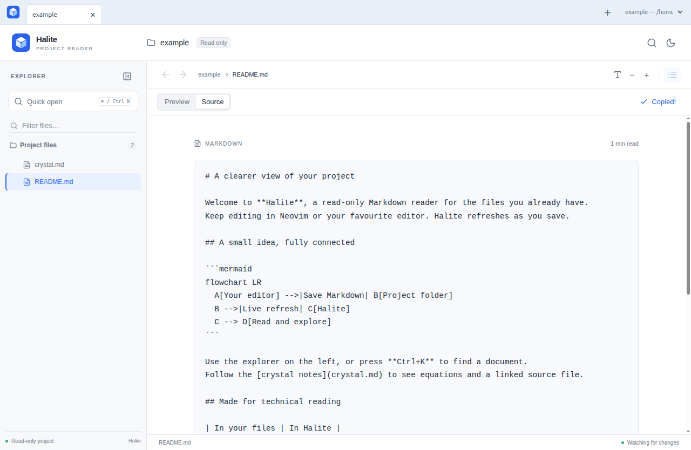

# Markdown source view and copying

Introduced in the 0.3.0 preview. A document reader should also let people reuse
the text they are reading: copy an email draft, paste a Markdown response, or
inspect markup without opening an editor.

## Interaction

The document toolbar has **Preview** and **Source** buttons plus **Copy Markdown**.
The controls appear only for successfully loaded Markdown documents. They are
disabled while a document request is pending so an old document is not copied
under a new breadcrumb. Text/source files keep their existing code-block copy
control, and directories have no Markdown actions.

Preview is the default. Source presents the original UTF-8 text in a selectable,
read-only monospace block, with long lines visually wrapped. Markdown syntax,
links, fenced code, and embedded HTML remain literal text. There is no editor,
additional file request, or save operation.

Copy Markdown works in either view and passes the loaded document's content
directly to the clipboard API. It does not trim whitespace, reconstruct text from
the rendered page, or remove Markdown formatting. Success displays **Copied!**
briefly. Empty files can be copied too.

If clipboard writing is denied or unavailable, Halite opens Source, selects the
complete source node, and explains how to copy with Ctrl+C or ⌘C. Manual selection
uses the browser's normal text-copy behavior, which can normalize line endings.
Halite never requests permission to read the clipboard. A late clipboard failure
after navigation or a content refresh cannot open the fallback for the wrong
document or report a stale success.

## Reader state

- Preview and Source retain separate scroll positions while the reader is open.
- Preferences and navigation history store Preview positions only. Source
  offsets cannot overwrite the rendered document's heading position.
- Navigation and reader reloads start in Preview. View switches do not add
  browser history entries.
- Project-tab switches retain the mounted reader's view. Moving a project
  between windows remounts it and starts in Preview.
- File-watch refreshes keep the selected view and update the source and copy
  payload. Source uses the same document size limits as Preview.
- The heading outline is temporarily hidden in Source and returns in Preview.
  Native find closes when the view changes; Ctrl+F can search the source.

`DocumentActions.tsx` owns copy feedback and guards pending clipboard requests.
`App.tsx` owns view selection, source selection, and independent scroll state.
`Workspace.tsx` validates the reader's view-change message before asking the
existing desktop bridge to clear native find. The backend and on-disk preferences
format are unchanged.

## Validation

Browser regressions cover CRLF text, indentation, Unicode, links, fenced Markdown,
literal script tags, clipboard denial, complete source selection, separate
positions, history and reload, live edits, empty files, non-Markdown documents,
stale clipboard promises, keyboard activation, and a 320-pixel layout. Desktop
checks use the real system clipboard and cover live source refresh, view
retention across project tabs, and native find in both views.
