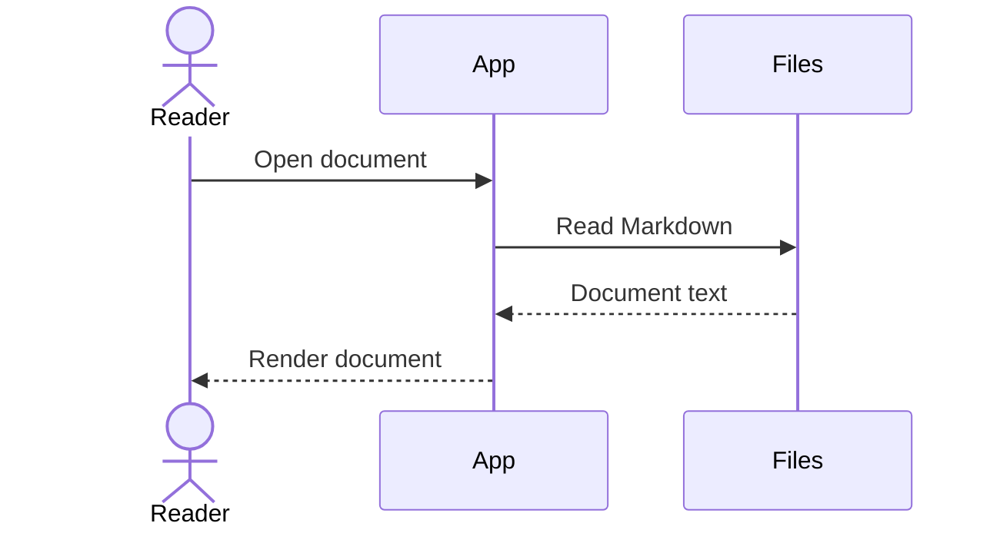

# Architecture

## Data flow

```mermaid
flowchart LR
    Files[Project files] --> Service[Local service]
    Service --> Reader[Document reader]
    Reader --> Explorer[File explorer]
```

## Request sequence

```mermaid
sequenceDiagram
    actor Reader
    participant App
    participant Files
    Reader->>App: Open document
    App->>Files: Read Markdown
    Files-->>App: Document text
    App-->>Reader: Render document
```

## Invalid diagram

```mermaid
this is deliberately invalid
```

The rest of the document remains readable when a diagram is invalid.
