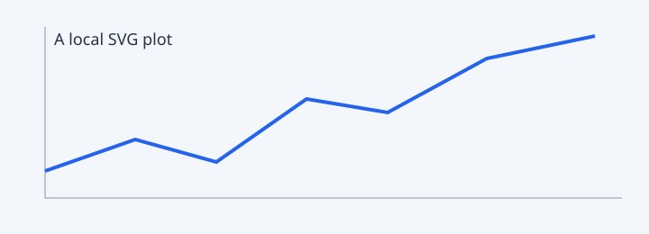

# Reading guide

Follow the [architecture](architecture.md#data-flow), the [equations](math.md),
or return to [the project root](/README.md).

## Checklists

- [x] Open a project directly
- [ ] Read the next document

## Code stays code

```text
project/
├── docs/
│   ├── README.md
│   └── architecture.md
└── example.py
```

Inline code such as `\(not math\)` remains literal.

## Local images



## Error handling

[A missing file](missing.md) should produce a useful message.
[An outside path](../../../outside.md) should be rejected.
[Unsafe protocol](javascript:alert(1)) must never run.

<script>window.markdownExecuted = true</script>

## Duplicate heading

First section.

## Duplicate heading

Second section.
